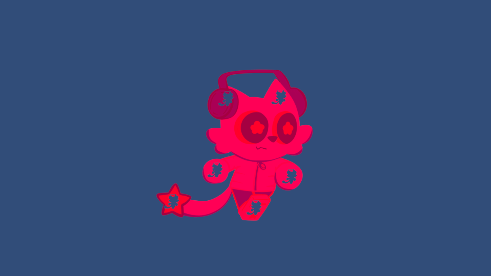

    

# UI Image Eraser for Unity by at0mGames
### Supports masks with alpha channel

### How Use:
1) Set the texture to the shader material.
2) Add material to the Image component.
3) Add a script and fill in the sterilized fields or copy from the demo scene.

### Download

